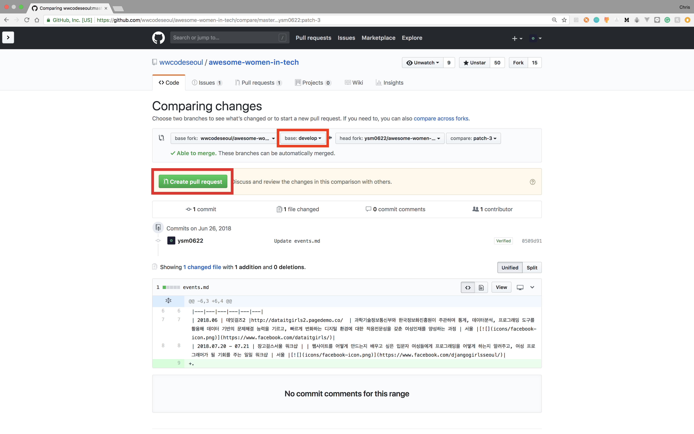

# 기여방법 안내서

깃허브가 익숙하지 않아 저장소에 기여하는 방법이 어려운 분들을 위한 간단한 안내서입니다.

다른사람의 깃허브 저장소에 기여하는 방법은 크게 두가지가 있습니다.

1.  [깃허브 웹페이지상에서 수정하고 풀 리퀘스트 날리기](#1-깃허브-웹페이지상에서-수정하고-풀-리퀘스트-날리기)
1.  [내 저장소에 복사(Fork) 후 수정해서 풀 리퀘스트 날리기](#2-내-저장소에-복사Fork-후-수정해서-풀-리퀘스트-날리기)

## 1. 깃허브 웹페이지상에서 수정하고 풀 리퀘스트 날리기

1.  수정하고자하는 문서에서 오른쪽 상단에 수정(🖊️) 버튼을 누릅니다.

2.  문서를 수정합니다.

3.  수정사항과 관련된 커밋메시지(제목)와 세부적인내용(설명)을 적고 `Propose file change` 버튼을 누릅니다. (한글로 적어도 무방합니다)

4.  수정사항을 다시한번 확인한 뒤 `Create pull request` 버튼을 누릅니다.

5.  풀 리퀘스트 제목과 세부적인내용을 적고 `Create pull request` 버튼을 누릅니다.

## 2. 내 저장소에 복사(Fork) 후 수정해서 풀 리퀘스트 날리기

아래 슬라이드쉐어 링크에 자세한 내용이 나와있으므로 링크로 대체합니다.

### [Github Pull Request 사용하기](https://www.slideshare.net/jungseobshin/github-pull-request)
